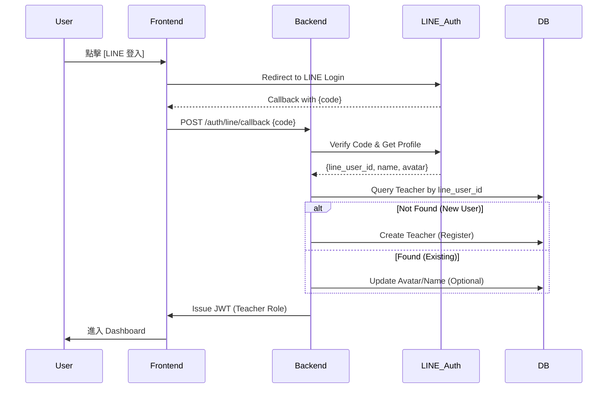
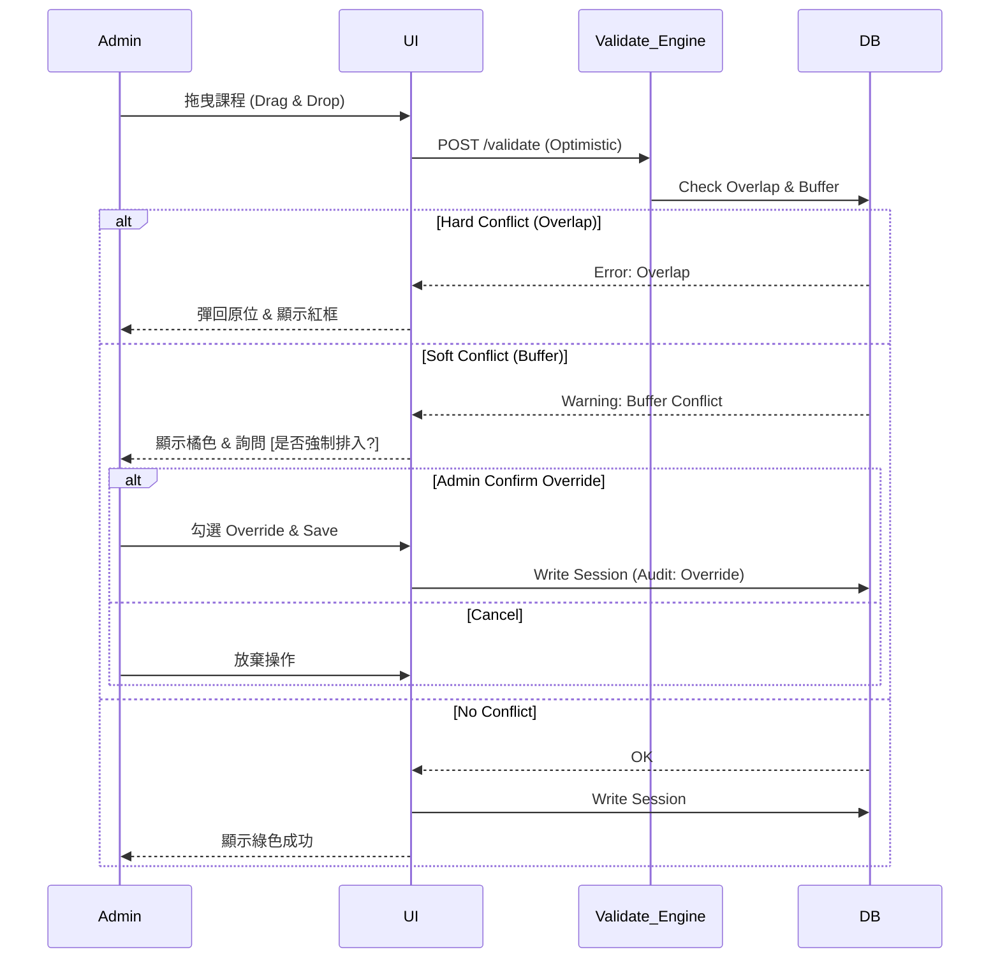
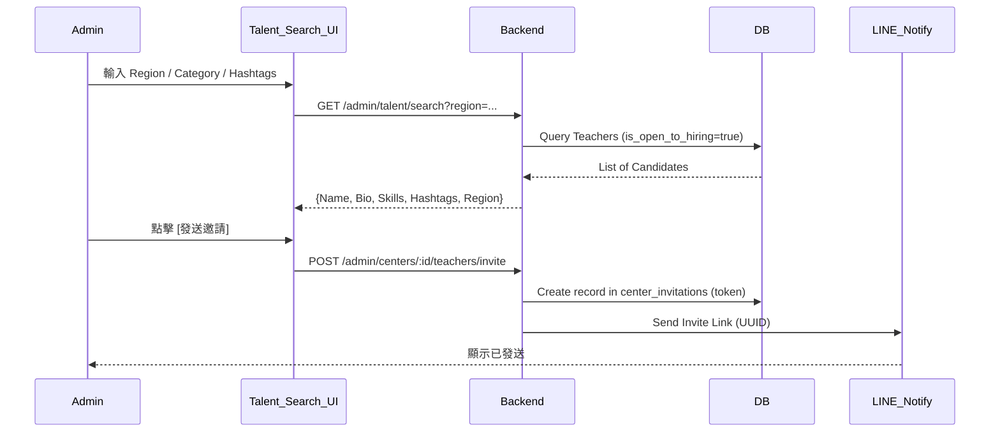
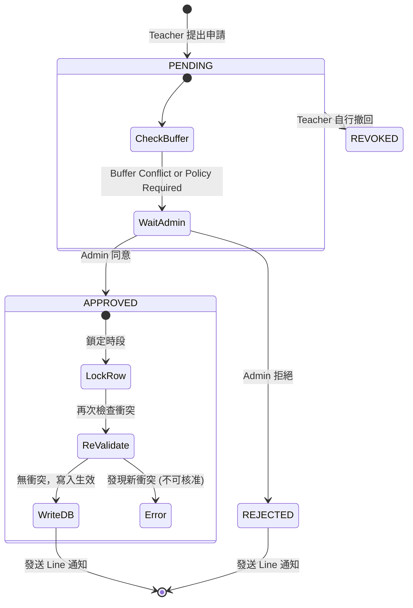

# 流程與權限控管 (Flows & Permissions)

為避免開發過程中的邏輯偏移，本文件將核心業務流程視覺化 (Sequence/Flow Charts)，並制定嚴格的權限矩陣 (RBAC)。

---

## 1. 核心流程視覺化 (Core Workflows)

### 1.1 老師登入與註冊流程 (Auth Flow)
確保 LINE 登入與帳號自動綁定的邏輯一致。

### 1.2 排課/衝突驗證流程 (Scheduling & Validation)
Admin 在網格上拖拉排課的即時互動。

### 1.4 人才搜尋與邀請流程 (Talent Discovery & Invitation) - *New*
管理員如何主動開發潛在老師。

### 1.3 異動與審核流程 (Exception Lifecycle)
最複雜的狀態流轉，包含 Re-validation。

---

## 2. 權限管控矩陣 (RBAC Matrix)

### 2.1 角色定義
*   **Visitor**: 未登入訪客 (無權限)。
*   **Teacher (Self)**: 登入的老師 (僅能操作自己的資料)。
*   **Center Admin**: 中心管理員 (僅能操作所屬中心的資料)。
*   **Super Admin**: 系統總管 (維運與除錯用)。

### 2.2 資源存取矩陣 (Access Control List)

| 資源 (Resource) | 動作 (Action) | Teacher | Center Admin | 備註 |
|:---|:---|:---:|:---:|:---|
| **Center Schedule** | View (Read) | ✅ (僅已加入中心) | ✅ (僅所屬中心) | |
| | Create/Edit (Write) | ❌ | ✅ | 老師不可直接改課表，需走 Exception |
| **Personal Event** | View (Read) | ✅ (Own) | ⚠️ (僅 Busy/隱私模式) | 中心僅看到 "Busy"，除非老師關閉隱私 |
| | Create/Edit (Write) | ✅ (Own) | ❌ | 中心不可修改老師私人行程 |
| **Exception (請假單)** | Create (Submit) | ✅ | ✅ (代申請) | |
| | Approve/Reject | ❌ | ✅ | 僅 Admin 有準駁權 |
| **Teacher Profile** | Edit (Bio/Skills/Region) | ✅ | ❌ | 老師擁有自己的專業履歷 |
| **Teacher Certs** | Upload/Delete | ✅ | ❌ | |
| | View (Read) | ✅ | ✅ (僅已加入中心) | 嚴格限制：未加入之中心不可見 |
| **Talent Pool** | Search/View Profile | ❌ | ✅ | 僅限開啟 `is_open_to_hiring` 的老師 |
| **Settings** | Update Center Policy | ❌ | ✅ | |
| **Admin Users** | CRUD (Add/Remove) | ❌ | ⚠️ (僅限 OWNER) | 嚴格鏈路：僅擁有者可增刪管理員 |
| **Audit Logs** | View (Read) | ❌ | ✅ | 協助中心內部稽核 |

---

## 3. 資料隔離防護 (Data Isolation Rules)

### 3.1 Hard Scope Check (強制 Scope 檢查)
所有 Backend API 在 Middleware 層必須強制檢查：
1.  **Admin Request**:
    *   JWT Claim 必須包含 `role: ADMIN`。
    *   URL Path 若包含 `/centers/:center_id`，必須驗證 `JWT.center_id == Path.center_id`。
    *   **禁止** 使用 `SELECT * FROM ... WHERE id = ?` (危險)。
    *   **必須** 使用 `SELECT * FROM ... WHERE id = ? AND center_id = ?`。

2.  **Teacher Request**:
    *   JWT Claim 必須包含 `role: TEACHER`。
    *   若存取 `schedule_sessions`，Query 必須內建 `WHERE center_id IN (teacher.joined_centers)`。
    *   若存取 `personal_events`，Query 必須內建 `WHERE teacher_id = JWT.uid`。

### 3.2 敏感個資遮蔽
*   **Line User ID**: 僅供系統綁定，不可回傳給前端 (Frontend 僅需知道 teacher_id)。
*   **Certificates**: 圖片 URL 需使用 Signed URL (由 S3/Storage 產生，時效性)，避免連結外流後被永久存取。
